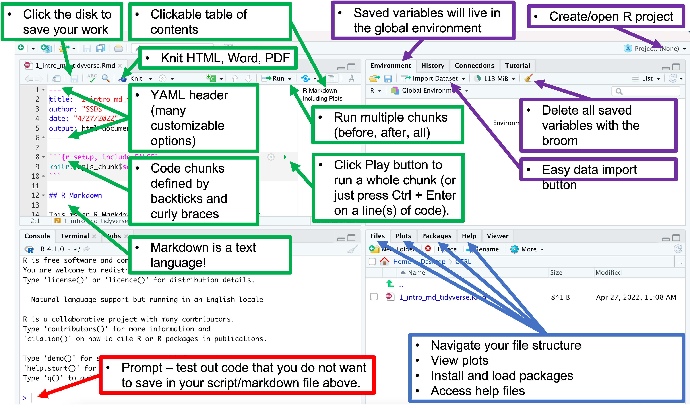

# Computational Social Science (CSS) example research workflow

Scientific research is necessary because it provides solutions to many problems, from those found in everyday life to the mysteries of existence. It is used to build knowledge, teach, learn, and increase awareness through cutting edge technologies and techniques that create new ideas and that are born out of creativity and curiosity. "Social" science research focuses on humans, their interactions, and the societies they exist within and relies on data - forms of information - for it to work. 

While it is fun to discuss the postmodern constructs for the definition of data, in the context of this workshop it is defined as quantitative and qualitative representations of information generally found in the form of numbers, text, images, video, and audio. 

How then, might we approach a data-intensive computational social science research project? The example below is a simplified representation. 


## Preparation

- **Read** the relevant literature in your field. What questions are those authors asking, and in what directions do they suggest future research should go? What are the limitations and other problems? 
- **Ask a question** forged from your knowledge of the literature. You can cobble together a virtually endless supply of research questions with some creative thinking and a critical perspective. 
- **Design** your research framework. What type of question(s) are you asking, what are the assumptions of the data you seek and what are your expected outcomes? 
- Define **milestones.** When is your final deadline? Divide your project into subparts. Completing smaller goals will not only give you a sense of progress, but will also allow you to see how the parts connect together and will improve the quality of yoru work. 

## Data

* **Acquire** data. All projects require some form of data, theoretical musings aside, whether you obtain it from a government or other organization, scrape it from the web, or collect it yourself. 
* **Import** the data into R. As you can see, there is a lot of work to be done even before the computational part! However, do not let this discourage you from experimenting with R.
* **Wrangle** your data when necessary. Ensuring its quality and validation is essential because the data will determine your results along with their interpretation. Inconsistencies and other errors are inevitable, especially when compiling data from multiple sources. Close visual inspection for errors is always a good first step, but you will likely spend much of your time fixing structural errors, standardizing names, handling missing values, dealing with outliers, and removing duplicate observations. You should always document your data wrangling process not only to inform your audience, but also in case you need to refer to back to it in the future. 

## Exploration
* **Summarize** your data. A common misconception is that a researcher must incorporate complicated methods and artificial intelligence to produce meaningful results. However, often-overlooked summary statistics can not only help cross-check your data wrangling, but can also elucidate patterns that can influence your assumptions and expectations. 
* **Visualize** aspects of your data. The goal of data visualization is to communicate some aspect of your data to an audience in a clear and concise way. 

## Analysis
* **Evaluate** specific facets of the data now that you have built a foundation to do so. 

## Presentation
* Effective communication of your subject matter is just as important as knowing your stuff. Whether you are presenting a slideshow to colleagues, poster, conference talk, webinar, or submitting a manuscript for peer-review, effective communication of your subject matter is just as important as knowing your stuff and takes a lot of practice.  

# Why R?

Data need to be imported, wrangled, explored, and analyzed in order to make contributions to legitimate bodies of knowledge. 

R is expert at these computational parts of the research process, It is a free (to use, not necessarily to develop!) and open programming language that helps you teach a computer to perform a "data science" task. Note that R was designed to do statistics/data science from its conception and has evolved that way. 

## What is RStudio?

RStudio is the graphical user interface/environment that we will program R inside of. It is really helpful for staying organized and offers much more functionality than the R language provides by itself. RStudio is also highly customizable. [Read the customization guide by clicking here](https://support.rstudio.com/hc/en-us/articles/200549016-Customizing-the-RStudio-IDE).

### Source files

So, where do we type instructions for these data related tasks

#### Script

Scripts are simply plain text files with a .R file extension. Click `File --> New File --> R Script` to open one. In R scripts: 
- Code is entered normally
- Hashtags `#` are used to comment your code, or make notes to yourself and others

#### R Markdown file

R Markdown files utilize markdown, a lightweight markup language, to allow you to intersperse code and formattable text. [Read the guide](https://rmarkdown.rstudio.com/lesson-1.html) to learn how to format your R Markdown files. 

Enter code in [chunks](https://rmarkdown.rstudio.com/lesson-3.html) and press `Control + Enter` to run a line of code, run multiple highlighted lines of code, or press the green "Play" button on the right side to run the entire chunk.

```{r}
2 + 2
cos(pi)
```

### Navigating RStudio



## R projects

R Projects files (.Rproj) are associated with your [**working directory**](http://www.sthda.com/english/wiki/running-rstudio-and-setting-up-your-working-directory-easy-r-programming) (the location on your computer that your actions are relevant to) and are great for staying organized by organizing your project and its context into a single location. The working directory is set and retrieved via a **file path**. 

> You can change the working directory location with the `setwd()` function, or by clicking "Session" --> "Set Working Directory" --> "Choose Directory" from the top toolbar menu. However, 

[Learn more about setting up an R Project by clicking here.](https://support.rstudio.com/hc/en-us/articles/200526207-Using-RStudio-Projects)

# Basic building blocks of R programming

You will find that no matter how complex of a task you are faced with, you will pretty much always rely on the same basic building blocks to accomplish it. However, it is up to you to arrange them in specific ways to accomplish something creative and meaningful. 

## Objects, functions, and arguments

Everything that exists in R is an **object** or some piece of information/data that can be manipulated. 

Almost everything that happens is a **function call**, or a command that performs an action on a "thing". Functions always contain trailing round parentheses `()`. 

These "things" are called **arguments** and are defined in function creation as **parameters.** 

## Variable assignment

Variables (which are also objects) are how data are saved in R's memory, which lives in a physical location on your computer. These are just placeholders and can contain virtually anything: values, mathematical expressions, text, functions, or entire datasets. 

`<-` is the assignment operator. It assigns values on the right to objects on the left. So, after executing `x <- 5`, the value of `x` is `5`. 

You can read this in plain language as "x is defined as 5", "5 is assigned to x", or most simply as "x is equal to 5".

This performs the assignment step. Note that the variable now appears on your "Environment" tab. 

Type the name of the variable and run it ("call" the variable) to show it on the screen. 

```{r}
x <- 5
x
```

## Data types: numeric, character, logical, integer, factor

Like everything else in R, data have a class (type) associated with it which determines how we can manipulate it. Use the `class()` function to find out. In this case, the variable `x` is the argument. 

We will talk about five basic types: 

1. Numeric: decimals; the default class for all numbers in R
2. Character: text, always wrapped in quotations `" "` (single or double are fine, be consistent)
3. Logical: TRUE and FALSE; stored internally as 1 and 0 and as such take on mathematical properties; useful for turning function parameters "on" or "off", as well as for data subsetting (see below).
4. Integer: positive and negative whole numbers, including zero
5. Factor: categorical data

1. Numeric class 

```{r}
class(x)
```

2. Character

```{r}
# use a hashtag within a code chunk to comment your code
# note the use of the underscore to represent a space in the variable name
my_name <- "Evan"
my_name
class(my_name)
```

3. Logical

In R, TRUE is 1 FALSE is 0
```{r}
TRUE + 1
FALSE - 1

# is 3 greater than 4?
3 > 4

# is 4 less than or equal to 4?
4 <= 4

# is "Apple" equal to "apple" (hint: R is case sensitive!)
"Apple" == "apple"

# is "Apple" not equal to "Apple"
"Apple" != "Apple"
```

4. Integer

We can use various "as dot" functions to convert data types. To convert numeric to integer class for example, we could type: 

```{r}
y <- as.integer(x)
y
class(y)
```

5. Factor

Other "as dot" functions exist as well: `as.character()`, `as.numeric()`, and `as.factor()` to name a few:

```{r}
school <- "Stanford University"
school
class(school)

# convert to factor
school_fac <- as.factor(school)
school_fac
class(school_fac)
```

It might seem difficult keeping track of variables you define, but remember they are listed in RStudio's "Environment" tab. You can also type `ls()` to print them to the console. 

```{r}
ls()
```

Remove a single variable with `rm()`

```{r eval = F}
rm(my_name)
my_name # Error
```

> Remember to use autocomplete when typing a function or variable name, since there is great potential for humans to make syntactical errors

Alternatively, you can wipe your Environment clean by clicking the yellow broom icon on the Environment tab or by typing

```{r}
rm(list = ls())
```

If your environment gets too messy, pressy `ctrl + l` to return the prompt to the top and make it more readalble. This also makes scrolling through your output much easier!

> To completely restart your R session, click "Session" --> "Restart R" from the top toolbar menu. 

## Data structures: vector, data frame

If saving one piece of data in a variable is good, saving many is better. Use the `c()` function to combine multiple pieces of data into a **vector**, which is an ordered group of the same type of data. 

> **vector**, which is an ordered group of the same type of data. 

We can nest the `c()` function inside of "as dot" functions to create vectors of different types. 

```{r}
# example numeric (default) vector
traffic_stops <- c(8814, 9915, 9829, 10161, 6810, 8991)

# Integer, logical, and factor vectors
city <- as.factor(c("SF", "DC", "DC", "DC", "SF", "SF"))
year <- as.integer(c(2000, 2000, 2001, 2002, 2001, 2002))

# Call these variables to print them to the screen and check their class
traffic_stops
city
year

class(traffic_stops)
class(city)
class(year)
```

A **data frame** is an ordered group of **equal-length** vectors. 

> More simply put, a data frame is a tabular data structure organized into horizontal rows and vertical columns, i.e. a spreadsheet! These are often stored as comma separated values (.csv) files, or plain text where commas are used to delineate column breaks and that look good in spreadsheet programs like Microsoft Excel. 

We can assemble our three vectors from above into a data frame with the `data.frame()` function. 

```{r}
police <- data.frame(city, traffic_stops, year)
police
class(police)

# display the compact structure of a data frame
str(police)
# class = data.frame
# 6 observations (rows)
# 3 variables (columns, or vectors)
# column names are preceded by the dollar sign 
```

# Challenge - dataframes

1. Create a dataframe that contains 6 rows and 3 columns by following the instructions above.

2. Advanced: what is the difference between a data frame and a tidyverse tibble? 

```{r}
## YOUR CODE HERE

data<-data.frame(matrix(ncol=3,nrow=6))
data

```

> `tibble` is a lazy version of data frame `tibble()` does much less than data.frame(): it never changes the type of the inputs (e.g. it never converts strings to factors!), it never changes the names of variables, it only recycles inputs of length 1, and it never creates row.names(). You can read more about these features in vignette("tibble")

```{r tibble}
library(tibble)
data <- data.frame(a = 1:3, b = letters[1:3], c = Sys.Date() - 1:3)
data

as_tibble(data)
```

## Indexing

A vector can be indexed (positionally referenced) by typing its name followed by its index within square brackets. For example, if we want to index just the first thing in the city vector, we could type

Note that R is a "one-indexed" programming language. This means that counting anything starts at 1.

```{r}
city[1]
# or
police$city[1]
```

If we want to return just the third thing in traffic_stops, we would type

```{r}
traffic_stops[3]
# or
police$traffic_stops[3]
```

## Subsetting single columns with `$`

Note that columns are preceded by the dollar sign `$`. You can access a single column by typing the name of your data frame, the `$`, and then the column name. Note that autocomplete works for much more than just function and variable names!

```{r}
# show just the column containing the number of traffic stops
police$traffic_stops

# ... which can then easily be plugged into another function
hist(police$traffic_stops)
```

## Subsetting rows and columns with bracket notation `[,]`

This can also be extended to rows and columns using bracket notation `[,]`

Type the name of your data frame followed by square brackets with a comma inbetween them. 

Here, we can enter two indices: one for the rows (before the comma) and one for the columns (after the comma) like this: `[rows, cols]`

For example, if we want two columns, we cannot use the dollar sign operator (since it only works for single columns), but we could type either the indices or the columns names as a vector! 

If either the row or column position is left blank, all rows/columns will be returned because no subset was specified. 

To subset the `police` with just the city name and number of stops columns, type

```{r}
city_and_stops <- police[,c(1,2)]
city_and_stops
# or, for consecutive sequences
city_and_stops <- police[,1:2]
city_and_stops
# or using variable names
city_and_stops <- police[,c("city", "traffic_stops")]
city_and_stops
```

> Keep in mind that redefining a variable will overwrite it each time, as we are doing here. 

We can do the same thing for rows by adding a vector of the row indices to include. For example, to keep just rows 1, 2, and 3 along with columns "city" and "traffic_stops" we could type: 

```{r}
subset1 <- police[1:3, c("city", "traffic_stops")]
subset1
```

Or, to keep rows 1, 2, and 4 along with "city" and "traffic_stops" columns:

```{r}
subset2 <- police[c(1,2,4), c("city", "traffic_stops")]
subset2
```

Subset by logical condition by using the logical operators discussed above: `==`, `>`, `<=`, etc.

For example, if you want to subset only rows with stops less than 9000 you would combine the dollar sign operator along with bracket notation. 

This performs a row subsetting operation based on the condition of a column. Note that the column position is left blank after the comma to indicate all columns should be returned.

```{r}
low_stops <- police[police$traffic_stops < 9000, ]
low_stops
```

Or, to include multiple conditions use logical and `&` (all conditions must be satisfied) and logical or `|` (just one condition must be satisfied). 

To subset just rows that contain SF as the city and stops less than 7000, type

```{r}
sf_low_stops <- police[police$city == "SF" & police$traffic_stops < 7000, ]
sf_low_stops
```

# Challenge - subsetting

1. Create a subset that contains data from DC or stops less than or equal to 7000 and just columns "city" and "traffic_stops"

2. Advanced: use the `filter()` and `select()` functions from the `dplyr` R package to do the same thing. 

```{r}
## YOUR CODE HERE

police[police$city == "DC" | police$traffic_stops <= 7000,  c("city", "traffic_stops") ]

# 
library(dplyr)
police%>%filter(city == "DC" |traffic_stops <= 7000)%>%select(city,traffic_stops)

```

## Getting help

R provides excellent help documentation that often tells you everything to know, but you might not know it yet! 

Type a question mark before a function name to view the help pages. 

Read the **Description** section to understand what the function does. 

The **Usage** section describes the parameters that you can pass arguments to. 

The **Arguments** list defines how the arguments work. 

Often included (but not always) below these sections are **Detiails** that offer more information, **Value** that describes the returned objects, **Notes**, **Authors**, **References** and copy/paste **Examples** to experiment with. 

```{r eval = F}
?c
?data.frame

# look at help pages for linear regression
?lm

# generalized linear models
?glm

# arithmetic mean
?mean

# histogram
?hist

# Wrap symbols in quotations to view their help files
?">"
?"&"
```

# Putting it all together: CSS research workflow example

Now that you have at least some basic familiarity with basic R syntax and functionality, let's work through a computational workflow example. 

## Package installations

Because R has evolved for statistical functionality, it has considerable variety in its built-in functionality. This means that you can accomplish many tasks without having to install additional user-defined software packages that contain shortcuts for virtually every discipline and that make R work smarter for you. 

However, you will likely find yourself needing functionality beyond what is built into R's base installation. 

```{r eval = F}
# Step 1. Physically download the files to your computer (Internet connection required)
install.packages("psych")
```
```{r}
# Step 2. Import the package's functionality with the library() function and link it to your current RStudio session (do this each time you close and reopen RStudio)
library(psych)
```

`??` to search help for package

```{r eval = F}
# you can also call help on some packages to view vignette's, or purposeful coding walkthroughs with double question marks
# Click "Introduction to the psych package - PDF" to learn more
??psych

?describe
?describeBy
```
```{r}
# summary statistics for pooled police
describe(police)

# summary statistics for police, by group 
describeBy(police, group = police$city)
```

If you have multiple packages to install, consider vectorizing them. 

Alternatively, package managers such as [pacman](http://trinker.github.io/pacman/vignettes/Introduction_to_pacman.html) provide increased and friendly usability. 

> NOTE: type no in your console and press the Return key if prompted with "Do you want to install from sources the package which needs compilation? (Yes/no/cancel)". If asked to update packages, type 1 in your console and press the Return key unless you have specific 

```{r, eval = FALSE}
# Step 1. Install the files 
install.packages(c("psych", "tidyr", "dplyr", "ggplot2", "broom", "tidycensus"))

# Step 2. Import them to your current session
library(psych)
library(tidyr)
library(dplyr)
library(ggplot2)
library(broom)
library(tidycensus)
```

## Import data

Import the Mesa, Arizona, USA, dataset from The Stanford Open Policing Project. 
```{r}
mesa <- read.csv("data/raw/az_mesa_2020_04_01.csv", 
                 stringsAsFactors = TRUE)
str(mesa)

# view the first six rows by default
head(mesa)

# count number of missing values
sum(is.na(mesa))

# calculate proportion of missing data
(sum(is.na(mesa))) / (nrow(mesa) * ncol(mesa))
```

## Wrangle

Subset only columns: date, subject_race, subject_sex, subject_age, officer_id_hash, violation, arrest_made

```{r}
clean <- mesa[, c("date", "subject_race", "subject_sex", "subject_age", "officer_id_hash", "violation", "arrest_made")]
str(clean)

# or

clean <- mesa[, c(2, 8, 9, 7, 10, 12, 13)]
str(clean)
```

## Summarize 

Get some quick facts about your data with the below functions

```{r}
# Tabulate frequencies of a single variable 
table(clean$subject_race)
table(clean$arrest_made)

# Compute crosstabs
table(clean$subject_race, clean$arrest_made)

# Produce summary statistics
# Six number summaries (minimum and maximum values, 1st and 3rd quartile boundaries, median, and mean) are returned for quantitative variables (i.e., subject_age)
# Frequencies are returned for non quantitative variables (all other columns)
summary(clean)

# use the describeBy() function from the psych package
# by sex
summary_sex <- describeBy(clean, group = clean$subject_sex)
summary_sex

# Or, just access the female data, and subset just subject_age and columns 3 and 4 (mean and sd)
mesa_female <- summary_sex$female["subject_age" ,3:4]
mesa_female
# or
mesa_female <- summary_sex$female["subject_age", c("mean", "sd")]
mesa_female
```

## Visualize

Perhaps there are differences in sex, race, and age within our data. Let's eyeball it to find out! 

A histogram can be used to view the distribution of one variable. 

```{r}
hist(clean$subject_age)

hist(clean$subject_age, 
     breaks = 5,  # 5 categories
     main = "Include a title")

hist(clean$subject_age, 
     breaks = 50, 
     col = "gray80",
     main = "Age distribution of Mesa, AZ USA traffic stops\n December 2-13 - March 2017",
     xlab = "Driver Age",
     ylab = "Frequency", 
     las = 1)

# Type colors() to see the 657 stock colors available 
# colors()
```

The data are positively skewed and we know from our summary statistics that the mean is ~37 years old and is widely dispersed. 

Boxplots can be used similarly to histograms to view the distribution of one variable, but we can conveniently plot categorical groupings side by side for interpretation. 

```{r}
# subject_sex
boxplot(clean$subject_age ~ clean$subject_sex)

# subject_race
boxplot(clean$subject_age ~ clean$subject_race)
```

## Analyze

We can now ask a question such as: are there statistically significant differences in arrests made by race? Something like a one-way analysis of variance (ANOVA) model can help us understand. 

```{r}
aov_race <- aov(clean$arrest_made ~ clean$subject_race)
summary(aov_race)
```

This p-value indicates that there are statistically significant differences by race. But, how do we know between which groups? We can use a post-hoc test to find out the pairwise differences, along with adjusted p-values. 

```{r}
TukeyHSD(aov_race)
```

Read the du Prel et al. article "Confidence Interval or P-Value" linked in the README file to learn more about hypothesis testing, point estimations, and confidence in analysis. 

## Interpret

Results of a one-way ANOVA could be interpreted to suggest that white drivers are stopped less than all other groups. Why might this be true? Is there bias in our data? Do sample size differences influence the results? Did we violate any [assumptions](http://www.sthda.com/english/wiki/one-way-anova-test-in-r) of the test? Would a non-parametric alternative such as `kruskal.test()` be more appropriate? These are the tough questions that are up to the researcher to investigate. 

# Save your work

> BINDER USERS! CLick the "More" button on the "Files" tab in Binder, and then select "Export" to download files or folders to your computer. Screenshot below: 


There are many ways to import and export data in R. 

We can save datasets and tables we create with the `write.csv()` function. The first argument is the variable name, the second argument is the file path/name.

> Note that we save this in the "preprocessed" data subfolder, and could even save it in a separate directory named "Tables" or something like that. 

```{r}
write.csv(police, file = "data/preprocessed/police.csv")
```

Where does it save? Use `getwd()` to find out. Also check out the [here R package vignette](https://cran.r-project.org/web/packages/here/vignettes/here.html) to learn more efficient ways of structuring and understanding 

We specified the "data" --> "preprocessed" folder of the parent directory "sicss-howard-mathematica-R-2022" folder. 

```{r}
getwd()
```

We can also use the `save()` function to save variables in an .RData file for easy loadindg in the next lesson. Save only the `clean` dataset like this:

```{r}
save(clean, file = "data/preprocessed/clean.RData")
```

# A note on computational reproducibility

"Reproducible" research is a term often discussed but rarely understood. It is something you want to build into your research design very early on! As a project nears completion, it is very difficult to make it reproducible in retrospect. Ask me if you want to learn more! 

* Replication = code + data 

* Computational reproduciblity = code + data + environment + distribution 

* Reproducibility checklist by [Roger Peng](http://www.biostat.jhsph.edu/~rpeng/)

    1. Start with science (avoid vague questions and concepts)
    
    2. Don't do things by hand (not only about automation but also documentation)
    
    3. Don't point and click (same problem)
    
    4. Teach a computer (automation also solves documentation to some extent)
    
    5. Use some version control 
    
    6. Don't save output (instead, keep the input and code)
    
    7. Set your seed 
    
    8. Think about the entire pipeline 

# Challenge - workflows

1. Reproduce the above workflow using the dataset "ca_oakland_2020_04_01 2.csv". 

2. Ask the question: how does the distribution of arrests vary by race? Hint: use a barplot (you might have to generate frequencies first to make the barplot!).

3. Save the "ca_oakland_2020_04_01 2.csv" dataset in a variable named oak. Use the `save()` function to save it in a file name "oak.csv" in the "data/preprocessed" folder.

4. Advanced: Use ggplot2 to make the barplot. 

What other statistical applications might be useful? 

<div class="tocify-extend-page" data-unique="tocify-extend-page" style="height: 0;"></div>